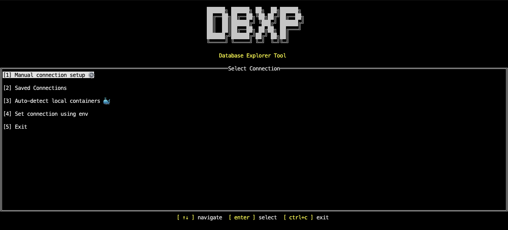
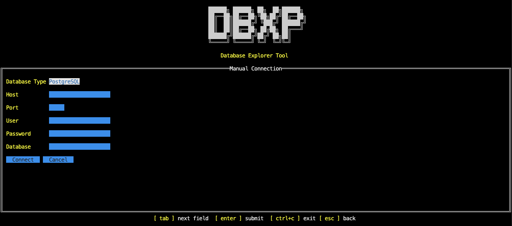
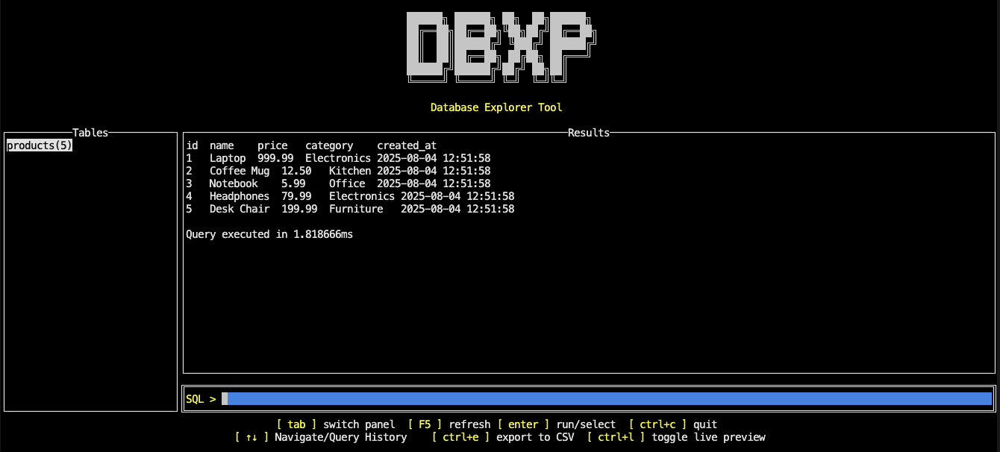

# DBXp - Database Explorer Tool

A terminal-based database explorer written in Go that provides an intuitive TUI (Terminal User Interface) for managing and querying databases.









## 🌟 Features

### 📊 **Database Management**
- **Multi-Database Support**: PostgreSQL, MySQL, and SQLite
- **Docker Integration**: Auto-detect databases running in local containers
- **Connection Methods**: Manual setup, saved connections, or environment variables
- **Live Connection**: Real-time database connectivity with error handling and retry mechanisms
- **Schema Explorer**: Browse tables in your database with an interactive sidebar
- **Real-time Updates**: Schema automatically refreshes after DDL operations

### 🔍 **Query Execution**
- **Interactive SQL Input**: Execute any SQL query with syntax support
- **Smart Query Handling**: Automatic detection of SELECT vs DDL/DML operations
- **Live Preview**: See query results as you type (with debounce and safety for SELECT queries only)
- **Result Display**: Clean, tabular output with proper formatting
- **Error Handling**: Clear error messages for failed queries

### 🕹️ **Navigation & UX**
- **Keyboard-Driven Interface**: Full hotkey navigation for all screens
- **Tab Navigation**: Switch between schema explorer and query input
- **Error Screen Navigation**: Intuitive back and retry functionality
- **Click-to-Query**: Click any table name to auto-generate `SELECT * FROM table;`
- **Query History**: Navigate through last 20 executed queries
  - `↑ Arrow`: Previous query (newer to older)
  - `↓ Arrow`: Next query (older to newer)

### 💾 **Export Functionality**
- **CSV Export**: Export query results to `export.csv`
- **Keyboard Shortcut**: `Ctrl+E` to export current results
- **Smart Formatting**: Handles NULL values and different data types
- **Error Handling**: Clear feedback on export success/failure

## 🚀 Quick Start

### Prerequisites
- Go 1.21+
- PostgreSQL, MySQL, or SQLite database
- Docker (optional, for database setup and auto-detection)

### Installation

1. **Clone the repository**
   ```bash
   git clone https://github.com/abhayishere/DBXp.git
   cd DBXp
   ```

2. **Install dependencies**
   ```bash
   go mod tidy
   ```

3. **Set up environment variables** (optional)
   Create a `.env` file:
   ```env
   DB_USER=postgres
   DB_PASSWORD=yourpass
   DB_HOST=localhost
   DB_PORT=5432
   DB_NAME=yourdb
   ```

4. **Run PostgreSQL** (if using Docker)
   ```bash
   docker run --name postgres-dbxp \
     -e POSTGRES_USER=postgres \
     -e POSTGRES_PASSWORD=yourpass \
     -e POSTGRES_DB=yourdb \
     -p 5432:5432 \
     -d postgres:latest
   ```

5. **Run the application**
   ```bash
   go run main.go
   ```

## 🎮 Usage

### Connection Setup
1. **Start the app**: Choose from multiple connection methods
2. **Manual Setup**: Enter database credentials manually
3. **Auto-detect**: Automatically find Docker containers running databases
4. **Environment**: Use pre-configured environment variables
5. **Saved Connections**: Access previously saved database configurations

### Basic Navigation
1. **Main Interface**: The cursor starts in the SQL input field
2. **Switch Panels**: Press `Tab` to focus on the schema explorer
3. **Select Tables**: Use `↑/↓` arrows and press `Enter`
4. **Execute Queries**: Type SQL and press `Enter`
5. **Live Preview**: Toggle with `Ctrl+L` to see results as you type

### Sample Test Data
```sql
-- Create a test table
CREATE TABLE users (
    id SERIAL PRIMARY KEY,
    name TEXT,
    email TEXT
);

-- Insert sample data
INSERT INTO users (name, email) VALUES
('Alice', 'alice@example.com'),
('Bob', 'bob@example.com'),
('Charlie', 'charlie@example.com');

-- Query the data
SELECT * FROM users;
```

### Query History
- Press `↑` to navigate to previous queries
- Press `↓` to navigate to next queries
- History stores your last 20 executed queries

### Export Results
1. Execute a SELECT query
2. Press `Ctrl+E` to export results to CSV
3. Check `export.csv` in your project directory

### Error Handling
- **Connection Errors**: Retry connection or go back to main menu
- **Query Errors**: Clear error messages with retry options
- **Navigation**: All error screens support `Esc` to go back and `Enter` to retry when applicable

## 🏗️ Architecture

### Project Structure
```
DBXp/
├── main.go                 # Application entry point
├── app/
│   └── app.go             # Main application logic and UI coordination
├── db/
│   ├── connect.go         # Database connection management
│   └── dbConfig.go        # Database configuration structures
├── handlers/
│   ├── events.go          # UI event handling
│   ├── query.go           # Query execution and live preview
│   ├── history.go         # Query history management
│   └── export.go          # CSV export functionality
├── ui/
│   ├── selection.go       # Connection selection and forms
│   ├── setLayout.go       # Layout management with hotkeys
│   ├── schema.go          # Schema explorer
│   └── mainlayout.go      # Main UI layout construction
├── contants/
│   └── hotkeys.go         # Keyboard shortcut definitions
├── utils/
│   └── logo.go           # ASCII art logo
├── connection/
│   └── detection.go       # Docker container detection
└── .env                   # Environment configuration
```

### Key Components

- **App**: Main application coordinator with UI state management
- **QueryHandler**: Manages SQL execution, live preview, and result formatting
- **EventHandler**: Handles keyboard inputs and user interactions
- **History**: Manages query history with navigation
- **Export**: Handles CSV export functionality
- **UI Components**: Schema explorer, connection forms, and layout management
- **SetLayout**: Unified layout system with hotkey support and error handling

## 🔧 Configuration

### Environment Variables
| Variable | Description | Default |
|----------|-------------|---------|
| `DB_USER` | Database username | `postgres` |
| `DB_PASSWORD` | Database password | `yourpass` |
| `DB_HOST` | Database host | `localhost` |
| `DB_PORT` | Database port | `5432` |
| `DB_NAME` | Database name | `yourdb` |

### Keyboard Shortcuts

#### Main Interface
| Key | Action |
|-----|--------|
| `Tab` | Switch focus between schema explorer and query input |
| `↑/↓` | Navigate table list or query history |
| `Enter` | Execute query / Select table |
| `F5` | Refresh schema |
| `Ctrl+L` | Toggle live preview mode |
| `Ctrl+E` | Export results to CSV |
| `Ctrl+C` | Exit application |

#### Connection & Navigation
| Key | Action |
|-----|--------|
| `↑/↓` | Navigate connection options or lists |
| `Enter` | Select connection method or confirm |
| `Tab` | Move between form fields |
| `Esc` | Cancel manual connection form / Go back from error screen |
| `Ctrl+C` | Exit application |

#### Error Screens
| Key | Action |
|-----|--------|
| `Esc` | Go back to previous screen |
| `Enter` | Retry failed operation (when available) |
| `Ctrl+C` | Exit application |

### Live Preview
- **Safe Queries Only**: Live preview only works with SELECT statements
- **Auto-Debounce**: 500ms delay prevents excessive database queries
- **Auto-Limit**: Automatically adds LIMIT 50 to preview queries for safety
- **Visual Indicator**: Live preview results are clearly marked in the output

## 🛠️ Development

### Building
```bash
go build -o dbxp main.go
```

### Running Tests
```bash
go test ./...
```

### Dependencies
- [tview](https://github.com/rivo/tview) - Terminal UI framework
- [tcell](https://github.com/gdamore/tcell) - Terminal handling
- [pgx](https://github.com/jackc/pgx) - PostgreSQL driver
- [go-sql-driver/mysql](https://github.com/go-sql-driver/mysql) - MySQL driver
- [mattn/go-sqlite3](https://github.com/mattn/go-sqlite3) - SQLite driver

### Features in Development
- Connection saving and management
- Advanced query syntax highlighting
- Multi-query execution
- Database schema visualization
- Table relationship mapping

## 🤝 Contributing

1. Fork the repository
2. Create a feature branch (`git checkout -b feature/amazing-feature`)
3. Commit your changes (`git commit -m 'Add amazing feature'`)
4. Push to the branch (`git push origin feature/amazing-feature`)
5. Open a Pull Request

## 📝 License

This project is licensed under the MIT License - see the [LICENSE](LICENSE) file for details.

## 🙏 Acknowledgments

- Built with [tview](https://github.com/rivo/tview) TUI framework
- Inspired by modern database administration tools
- PostgreSQL, MySQL, and SQLite communities for excellent Go drivers
- Docker community for container detection capabilities

---

**Perfect for developers who prefer terminal-based tools and need quick database inspection without heavy